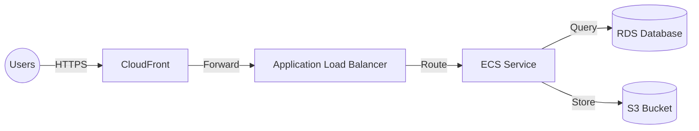

# Quick Start Guide - New Features

## 🚀 Getting Started with Component Lists and Pseudo Diagrams

### What's New?

This application now generates **two additional outputs** alongside your architecture diagrams:

1. **📋 Structured Component List** - A hierarchical breakdown of all components
2. **🔤 Pseudo Diagram Description** - Text-based diagram syntax for visualization tools

---

## How to Use

### Method 1: Generate a New Diagram

1. **Upload a PDF** on the main page
2. **Click "Generate Diagram"**
3. After generation, you'll see **three buttons**:
   - 📥 **Download Diagram** - Save the PNG image
   - 📋 **Component List** - View structured components
   - 🔤 **Pseudo Diagram** - Get text-based syntax

### Method 2: From Gallery

1. **Navigate to Gallery** (top-right button on main page)
2. **Find your diagram** in the gallery
3. Each card has **four buttons**:
   - 📥 **Download** - Save the PNG
   - 👁️ **View** - Open in new tab
   - 📋 **Components** - View component list
   - 🔤 **Pseudo** - View pseudo diagram

---

## Component List Features

### What You'll See:
- **Project Name** and summary
- **Component Categories** (Compute, Storage, Network, Security, etc.)
- **Total Component Count**
- **Expandable/Collapsible** categories
- **Color-coded** component types:
  - 🟠 Orange = Compute
  - 🔵 Blue = Storage/Database
  - 🟢 Green = Network
  - 🔴 Red = Security
  - 🟣 Purple = Integration

### Component Details:
- **Name** - Component identifier
- **Type** - Category classification
- **Description** - Purpose and configuration
- **Relationships** - Connected components

### Navigation:
- 🏠 **Home** - Return to main page
- 📂 **Back to Gallery** - View all diagrams
- 🔤 **View Pseudo Diagram** - Switch to syntax view

---

## Pseudo Diagram Features

### What You'll See:
- **Mermaid Syntax** - Text-based diagram definition
- **Copy Button** - Copy syntax to clipboard
- **Download Button** - Save as text file
- **Usage Instructions** - How to visualize the syntax
- **Recommended Tools** - Links to visualization platforms

### How to Use the Syntax:

1. **Click "Copy"** to copy the syntax to clipboard
2. **Open a visualization tool**:
   - [Mermaid Live Editor](https://mermaid.live) - Recommended
   - [draw.io](https://app.diagrams.net)
   - [Lucidchart](https://www.lucidchart.com)
3. **Paste the syntax** into the tool
4. **Customize** colors, layout, and styling

### Navigation:
- 🏠 **Home** - Return to main page
- 📂 **Back to Gallery** - View all diagrams
- 📋 **View Component List** - Switch to components view

---

## Tips & Best Practices

### Component List
- ✅ **Expand all categories** to see full architecture
- ✅ **Look for relationships** to understand data flows
- ✅ **Use color coding** to identify component types quickly
- ✅ **Take screenshots** for documentation

### Pseudo Diagram
- ✅ **Copy before modifying** - Keep original syntax
- ✅ **Test in Mermaid Live** - Free and fast
- ✅ **Download for backup** - Save the text file
- ✅ **Customize freely** - Edit syntax for your needs

---

## Troubleshooting

### "Request data not found" Error
**Cause:** The component list/pseudo diagram is only available for newly generated diagrams.

**Solution:** 
- Generate a new diagram to access these features
- Old diagrams in the gallery won't have request IDs

### Copy Button Not Working
**Cause:** Clipboard API not available in your browser.

**Solution:**
- Manually select all text in the textarea
- Press `Ctrl+C` (Windows) or `Cmd+C` (Mac)
- Use the Download button as an alternative

### Visualization Tools Won't Render
**Cause:** Syntax formatting issues or tool compatibility.

**Solution:**
- Ensure you copied the complete syntax
- Try a different visualization tool
- Check for any extra characters or formatting

---

## Examples

### Example Component List Structure:
```
📦 E-Commerce Platform
├─ 🟠 Compute & Application
│  ├─ ECS Service
│  ├─ Lambda Functions
│  └─ Auto Scaling Group
├─ 🔵 Storage & Database
│  ├─ RDS Database
│  ├─ DynamoDB Table
│  └─ S3 Bucket
├─ 🟢 Networking
│  ├─ CloudFront
│  ├─ ALB
│  └─ VPC
└─ 🔴 Security & Access
   ├─ WAF
   ├─ IAM Roles
   └─ KMS
```

### Example Pseudo Diagram:


---

## FAQ

**Q: Can I edit the component list?**
A: Currently, component lists are read-only. You can take screenshots or copy text.

**Q: Can I export the pseudo diagram in other formats?**
A: Yes, use visualization tools to export as PNG, SVG, PDF, etc.

**Q: Do old diagrams have component lists?**
A: Only newly generated diagrams (after this update) have component lists and pseudo diagrams.

**Q: Can I share the pseudo diagram with my team?**
A: Yes, use the Download button to save the text file and share it.

**Q: Which visualization tool is best?**
A: Mermaid Live Editor is recommended for quick previews. For advanced editing, use draw.io or Lucidchart.

---

## Need Help?

- 📖 **Full Documentation:** See `FEATURE_DOCUMENTATION.md`
- 🐛 **Issues:** Check the console for error messages
- 💡 **Tips:** Hover over buttons for tooltips

---

**Enjoy the enhanced architecture diagram experience!** 🎉

